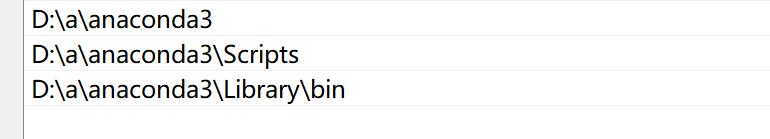
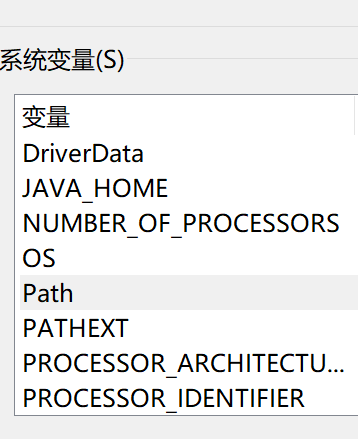
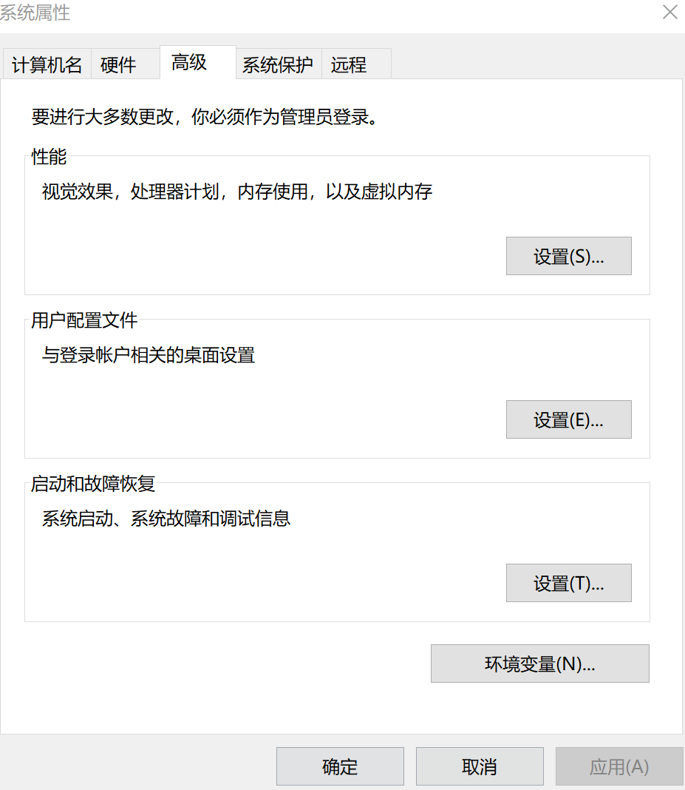

## Welcome to My Blog

这里是一个新人的blog,分享学习过程遇到的问题和我的理解与解答,欢迎和我一起讨论学习,不胜感激!

以下是我安装anaconda时遇到的一些问题,希望我的回答能够帮到你

### 安装anaconda的环境变量配置




it's easy to get familiar with,right?

###以下是改源时遇到的问题,与此同时,这也将是我的笔记,用于查阅(当我再次忘记时)
以下以conda为例,pip换源较为简单,故略过之
指令1.添加源:(清华源)
  - https://mirrors.tuna.tsinghua.edu.cn/anaconda/pkgs/free/
  - https://mirrors.tuna.tsinghua.edu.cn/anaconda/cloud/msys2/
  - https://mirrors.tuna.tsinghua.edu.cn/anaconda/cloud/conda-forge/
  (中科大源)
  - https://mirrors.ustc.edu.cn/anaconda/cloud/conda-forge/
  - http://mirrors.ustc.edu.cn/anaconda/pkgs/free/
  (阿里源)
  - https://mirrors.aliyun.com/pypi/simple
  添加指令为:>>>conda config --add channels channels    (也可以用于更改次序)
指令2.查看源:
  指令为:>>>conda config --show channels
指令3.确认更改:
  指令为:>>>conda config --set show_channel_urls yes
指令4.移除源:(撰写时清华源已不再提供anaconda相关服务了,因此需要移除相关源)
  指令为:>>>conda config --remove-key channels


# Header 1
## Header 2
### Header 3

- Bulleted
- List

1. Numbered
2. List

**Bold** and _Italic_ and `Code` text

[Link](url) and 
```

For more details see [GitHub Flavored Markdown](https://guides.github.com/features/mastering-markdown/).

### Jekyll Themes

Your Pages site will use the layout and styles from the Jekyll theme you have selected in your [repository settings](https://github.com/projaet/melolowb.Github.io/settings). The name of this theme is saved in the Jekyll `_config.yml` configuration file.

### Support or Contact

Having trouble with Pages? Check out our [documentation](https://help.github.com/categories/github-pages-basics/) or [contact support](https://github.com/contact) and we’ll help you sort it out.
